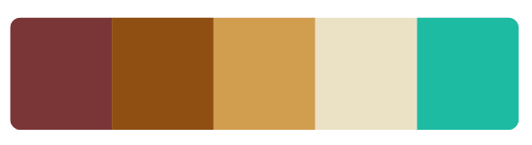
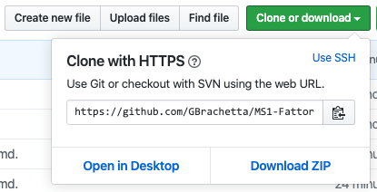

<H1 align="center"><b>FATTORIA DI COLLEMEZZANO</b> </h1>

  

 This site is live in <a href="https://gbrachetta.github.io/Fattoria/"> GitHub Pages </a>

This is the website of Fattoria di Collemezzano, an agroturismo located in the heart of Tuscany, Italy. Agriturismos are typically Italian. They are "farm-stays" and have been (at least until recently) Italy's best-kept accommodation secret. They provide not just accommodation but a way to experience Italian countryside. Fattoria di Collemezzano is an independently owned estate around Cecina, just in the border between the provinces of Pisa and Livorno in Tuscany.

# <b>UX</b>
## STRATEGY PLANE
## To whom is this website addressed

- Tourists.
- Families (with pets).
- For average 2 weeks periods.
- Mostly during the summer holidays, but not limited to it.
- Predominantly Europeans: Italian, Dutch, German, French, Swiss and in general people who would be able to reach it at a reasonable driving distance.
- People travelling by car: they will visit points of interest, restaurants, landmarks, beaches around.

## Is the content relevant?

- It must clearly provide practical information.
- It must describe and depict facilities and common spaces.
- It must stress that it is children and pet friendly.
- It must show points of interest.
    - Landmarks
    - Beaches
    - Touristic attractions
    - Shopping options
- It must show that it is a family owned business and as such there’s immediate response to all needs and direct contact.
- It must stress on a relaxed, holiday-like approach, not institutional.
- It must provide clear visual information of the location.
- It should display reviews or comments from other users, to give the customer the possibility to relate to people with positive experiences.

## Is the technology appropriate?

People searching for a holiday destination take time in making an informed decision and they generally rely on a website with descriptions and a rich visual content. For many, this is the only holiday they have a year and so they require extensive information on what to do in the resort and nearby.

## What makes Fattoria di Collemezzano so special?

There’s a lot of competition in the Agriturismo industry in Italy and many offer excellent value, but we can stress how our estate is a traditional, historic building with a lot of space, comfortable apartments and diverse areas of recreation. We can also emphasise the excellent location, near the sea but at very short distance from culturally relevant places (Florence, Siena, Pisa, Livorno, Lucca). This is relevant especially for days with weather not appropriate for typical summer activities or for stays off-season.

## What are the tech considerations?

We would like to make a strong visual impact.
Some of the challenges we would like to tackle are:

- Video landing page, for an immersive first impression.
- Static photo on mobile-sized devices to avoid high data consumption.
- Sufficient photos showing what the client can expect, but due to the number of pictures we plan to have, we would like to compact them using elements like carousels so they don’t become overwhelming or intrusive.

Our user will probably favour desktop browsing over mobile due to the nature of the information they’re looking for.

## Why would a user want this?

Most people go on holidays and there’s a lot on offer. We cannot pretend to be the best but will show with honesty and with a personal and approachable touch what we can offer.

## Who else is doing this?

There are a lot of people doing this, but at the same time there are a lot of people wanting it. 
The amount of places on offer is big, but not unlimited and due to the nature of a Hotel, there are limited places and availability. 
It’s not a matter of if they will choose us or not, it’s rather a matter of being amongst the first ones chosen when comparing different alternatives. 
Often Agriturismos show a very much business-like approach and they lose the personal touch of a family-run company.

## RESEARCH

For this project some research has been carried on. The participants gave the following items relevance, in order of importance:

### What do they want to find?
1. General information
2. Photos
3. Degree of comfort
4. Price
5. Location and points of interest nearby
6. Reviews

### Content importance
1. Photos
2. Price and reservation or information request options
3. Amenities (playground, swimming-pool, spaces for children)
4. Activities and places of interest
5. Contact details

### What determines their choice?
1. Size and comfort of the apartment
2. Amenities (playground, swimming-pool, spaces for children)
3. Price
4. Distance to poinst of interest
5. Personalised treatment
6. Organised activities

## What makes a good user experience?

- Finding straightforward and sufficient information.
- Finding good images and descriptions.
- Finding the advantages of the place compared to others.
- Finding clear information regarding price.
- Finding an easy way to get in touch and make a reservation.
- The application will probably be used just once, so it has to make the right impact immediately and stand out.
- It has to appeal to an emotional response.

## What’s worth doing?

- Well-presented imagery
- An appealing, immersive landing page (video)
- The inclusion of a map with which the user can interact.
- Easy to find, straightforward form
- Clean and concrete navigation.
- Not excessive content, not excessive text.

## Priorities

- Create presence
- Create a network of customers (a happy customer will return and recommend our business)
## STRUCTURE AND SKELETON PLANES
## Wire frames

- <a href="./wireframes/0_structure.png"> Structure</a>
- <a href="./wireframes/1_homepage.png">Homepage</a>
- <a href="./wireframes/2_about.png">About</a>
- <a href="./wireframes/3_apartments.png">Apartments</a>
- <a href="./wireframes/4_individual_apartment.png">Individual apartments</a>
- <a href="./wireframes/5_contact_bookings.png">Contact</a>

## USER STORIES
## For people looking for a holiday resort
- The images, video and descriptions of the place and places nearby provide enough and engaging information.
- The design relies a lot on visual impact with stress in the authenticity of the place.
- The website makes emphasis on the fact that it is or offers:
    - Family/children/pets friendly
    - Excellent location
    - Personal tratment
- Easy Navigation
- The navigation highlights indicate visually where the user is in the website and where they can go.
- The logo always takes the user back to the homepage
- Besides the Navigation Bar, different call to action buttons invite the user to perform an action (book, go back, open).
- Images
    - Well organised and distributed.
    - When several images need to be displayed, they are organised in carousels or accordion to prevent clutter.
- After eventually making a choice, the user has the chance to make a booking or request extra information.
- The form doesn't oblige the user to make a reservation, as only name, surname, phone number and email address are required fields. In this way the user can send the form asking for more information or sending a comment or message.

## FOR OWNERS
- The owners have the possibility to show their product.
- The owners have an easy way to be contacted.

# FEATURES IMPLEMENTED

## Common features
- Each page contains a responsive navigation bar with logo on the top left. For mobile-sized devices a button on the top-right expands a menu with links to the different pages on the website. On larger devices the expanded menu is shown instead.
- Every page contains a footer with contact information on the left and links to social media on the right by way of social media icons (the owner currently only uses Facebook, links to Twitter and Instagram land on their respective homepages). 
- The navigation reacts with a visual transition where it's clickable. The same transition is applied to the social media icons in the footer of all pages. 
- There's copyright information beneath.

## Homepage

- On mobile devices there's a hero image with overlay text covering the surface of the device.
- On larger displays the hero static image is replaced by a fluid video hosted externally, with the same overlay as the mobile version. (The static image takes over on mobile devices to save user's data in case they are browsing using mobile networks) in order to provide with an immersing first impression.
- Immediately beneath there's a carousel with slides and general descriptive text of what Fattoria di Collemezzano has to offer.
- Underneath there's an interactive map that can be zoomed in/out by the user to find the location and refer to points of interest, followed by descriptive text.
- Beneath this there's a vertical accordion with different titles. Each tab contains a photo and a longer description. All of them are initially collapsed on loading. This has been done to avoid clutter, since the information provided here is more extensive regarding points of interest around the Fattoria (art and culture, beaches, thermal waters, sport activities).

## About

- The first visible content is a photo of the owner and a personal message.
- Beneath there are photos of the different facilities to be encountered in the Fattoria, accompanied by descriptive text.
- Underneath there's a section with reviews from previous customers.
- This page displays photos and text, no interactive content besides navigation bar and social icons.

## Apartments

- The four small sections of this page display each a single image of each of the apartments offered, brief descriptive text and a call to action button leading to find out more information about each of the units or perform a booking request.

## Individual Apartments Pages

- These are the pages opened by clicking the call to action button from the previous page.
- Each of the four Individual Apartments page displays a carousel to accomodate several photos of the apartment without cluttering and more extensive descriptions.
- They display clear information about the price and a call to action button opening contact.html in order to interact with the form to make a reservation or request information.
- They also have an extra (smaller) call to action button to go back to the Apartments Page from where these ones came from.

## Contact

- This page includes a form with 4 required fields (requirement also underlined by their red border)
    - Name
    - Surname
    - Phone Number
    - Email Address
- The form also includes a variety of non required fields. Booking is not compulsory (not required fields)  and the form can be used to enquire extra information or send a message. 
- The page closes with a personal message from the owner, again underlining direct and personal contact with the user.

## Color Palette

The colour palette used include different shades of typically Tuscan colours (also known as Siena colours) plus the addition of a complementary shade of turquoise for active menu items and active social media icons.

## Fonts

- The font-family chosen for the titles is Sacramento, a cursive font with an informal and cosy touch.
- For almost all text, the choice was Lato for its good legibility at light weight.
- Finally the only occurence of the third font-family, Josefin Slab, was used to underline the slogan "Welcome <strong>to your second home</strong>.

## Features to implement in the future

- Fully functional form with captcha (Javascript required)
- Reviews linked to Tripadvisor or similar (More technology needed)
- Email sent back acknowledging request for booking or information
- Additional languages pages (requires professional translator)

# TECHNOLOGIES USED

## Language
- HTML
    - Hypertext Markup Language.
- CSS
    - Cascading Style Sheet.
- JavaScript
    - For polyfills on `type="date"` fields in form and copyright year in the footer.

## Framework

- <a href="https://getbootstrap.com/">Bootstrap</a>
    - For page structure, responsive layout and basic styling.

## Tools
- <a href="https://fontawesome.com/">Font Awesome</a>
    - For icons used for social network.
- <a href="https://fonts.google.com/">Google Fonts</a>
    - For the fonts used on this website.
- <a href="https://vimeo.com/">Vimeo</a>
    - For hosting the video.
- <a href="https://jquery.com/">jQuery</a>
    - For the functioning of the responsive navbar through Javascript.
- <a href="https://popper.js.org/">Popper.js</a>
    - For the functioning of the responsive navbar through Javascript.
- <a href="https://www.adobe.com/products/illustrator.html">Adobe Illustrator</a>
    - To create the logo image.

# TESTING

## Validation
This website has gone through validation using the following resources

- HTML <a href="https://validator.w3.org/">Validation</a>
- CSS Validation <a href="https://jigsaw.w3.org/css-validator/">Here</a> and <a href="http://csslint.net/">Here</a>
- <a href="https://autoprefixer.github.io/">AutoPrefixer</a>
    - For checking browser compatibility of the CSS code.
- <a href="https://www.google.com/chrome/">Google Chrome Developer Tools</a>
    - For permanently checking, testing on the fly, identifying issues and controlling device compatibility.

    

## Testing Performed
- The website was tested on all major browser in different platforms and operating systems.
- The website was tested in mobile devices of different sizes and makers, and proved to react responsively.
- The website was tested in Developer Tools in Chrome (Mac) to simulate different scenarios.

## Known Issues

- The two fields `type="date"` in the form in contact.html display a validation warning:
    - Safari and IE don't include a native datepicker. As a workaround I included a script in contact.html for a polyfill which adds a datepicker functional also in Safari and IE. Credit to <a href="https://github.com/Eventyret">Simen Daehlin</a> for this solution.

# DEPLOYMENT

## GIT
The following commands were used during the process
- `Git add "filename"` or `Git add .`
    - To stage files.
- `Git commit -m "message"` 
    - To commit files previously staged.
- `Git push` 
    - To push commits to my repository.

## GitHub and Publishing

The project can be found on GitHub.

The website is hosted on GitHub Pages and will update as new commits occur.

Further work and commitments will temporarily stop during the period while this project is reviewed and graded.

The method used to deploy this website was as follows:
1. In GitHub, navigated to my repository.
2. Under my repository, clicked "Settings".
3. Under the "GitHub Pages" section, used the Source drop-down menu and selected a publishing source, in this case <strong> Master Branch </strong>.
4. The website was immediately published and a green tab appeared with a link to the live website.
5. The link obtained is the one displaying at the top of this document.

This project can be ran locally by going to this <a href="https://github.com/GBrachetta/MS1-Fattoria">Repository link</a> and clicking on the <strong>Clone or Download</strong> button and copying the link provided.
 

In your IDE, open a Terminal window and change to the directory where you want to clone this project and type  `Git clone "your copied link"`.

After pressing Enter the project will be created and cloned locally.

# CREDITS AND ACKNOWLEDGEMENTS 

## Media
- Video shot and edited by me.
- All aerial photos taken by me.
- Apartments images used with permission of the owner of Fattoria di Collemezzano, Francesca Russo.
- Some descriptive text originally hosted in current website of Fattoria di Collemezzano, used with permission by the owner, Francesca Russo.
- The images in the accordion in index.html sourced from <a href="https://www.google.com/imghp?hl=en">Google Images</a>.
- The logo designed and created by me on Adobe Illustrator. It's an "F" using the font of the main headers, contained inside an object shaped in the form of a "raviolo", many of which (never too many!) make one of the most traditional Italian dishes: Ravioli.

## Content
- All content created by me, except the ones otherwise mentioned in the previous paragraph.

## Code
All credit has been mentioned in the relevant sections of the code. Special mention to:
- Carousel with fade effect from <a href="https://mdbootstrap.com/docs/jquery/javascript/carousel/">Mdbootstrap</a>.
- Logo drop shadow from <a href="https://stackoverflow.com/questions/3186688/drop-shadow-for-png-image-in-css">Stack Overflow</a>.
- Text overlay for Hero image and video adapted for this site from Anna Greaves' <a href="https://github.com/AJGreaves/portrait-artist">Portrait Artist, Milestone 1, Code Institute</a>.

## Acknowledgements
- To all members of Code Institute active on Slack and ready to help on everything at random times. Special mentions of unvaluable help at this stage: <a href="https://github.com/Eventyret">Simen Daehlin</a>, <a href="https://github.com/AJGreaves">Anna Greaves</a> and all mentors, tutors, alumni and students always ready and generous to help.
- To <a href="https://github.com/5pence">Spencer Barriball</a>, my mentor for this project.
- To Rut for her constant patience and support.